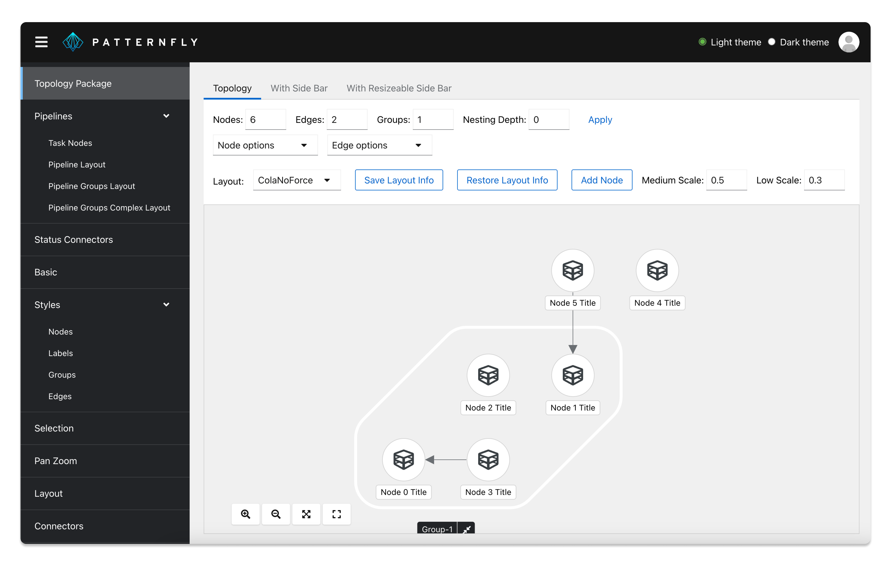

[the general Topology prerequisites]: ../../README.md#prerequisites
# Topology demo app

To help you better understand and visualize the different Topology components, we have created an interactive demo, [which is contained here.](https://github.com/patternfly/react-topology/tree/main/packages/demo-app-ts)

Continue reading for instructions on how to build and run the demo app. 

### Prerequisites

In order to run the demo app, you need to make sure the following prerequisites are met. 

1. Make sure that you have yarn installed, as outlined in [the general Topology prerequisites].
1. Make sure that you have the PatternFly React library installed. [Follow these instructions if you  need to install this package.](https://github.com/patternfly/patternfly-react?tab=readme-ov-file#install-and-configure-patternfly-react)
1. If you haven’t already, clone [the Topology project](https://github.com/patternfly/react-topology) and navigate to your local directory:

``` 
git clone https://github.com/patternfly/react-topology.git
cd react-topology
```

### Running the demo app

Once you’ve set up the prerequisites, you can follow these steps to run the demo app on your local machine

1. In a terminal, type the following commands to start the `react topology docs workspace`:

```
yarn install
yarn start
```

2. In a **separate** terminal window, type the following commands to navigate to `demo-app-ts` and launch the demo app:

```
cd packages/demo-app-ts
yarn start:demo-app:hot
```

3. You will receive a message confirming that the app is running, as well the URL that you can enter in your browser to load the app:

```
<i> [webpack-dev-server] Project is running at:
<i> [webpack-dev-server] Loopback: http://localhost:3000/
```

4. Explore the demo app in [your browser](http://localhost:3000/)



## Need help? 
If you find a bug, have a request, or have any questions about Topology that aren't answered in our documentation, please [reach out to us on Slack.](https://patternfly.slack.com/archives/CK7URGJ2W)
